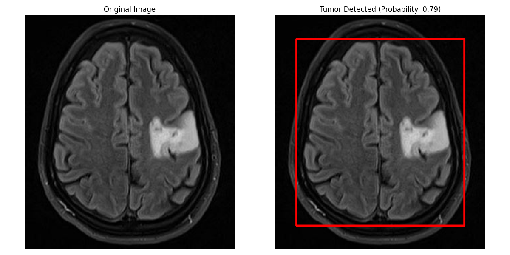

# Brain Tumor Detector

This project implements a brain tumor detection system using MRI images. It uses Python, OpenCV, and scikit-learn to process images, train a model, and visualize results.

## Table of Contents
- [Overview](#overview)
- [Requirements](#requirements)
- [Installation](#installation)
- [Usage](#usage)
- [Examples](#examples)
- [Contributing](#contributing)
- [License](#license)

## Overview

The Brain Tumor Detector is designed to analyze MRI images and identify the presence of brain tumors. It uses a Support Vector Machine (SVM) classifier trained on features extracted from MRI scans. The system includes functionality for:

- Loading and preprocessing MRI images
- Extracting relevant features from the images
- Training an SVM model
- Evaluating the model's performance
- Visualizing the detection results

## Requirements

- Python 3.7+
- OpenCV
- NumPy
- scikit-learn
- matplotlib

## Installation

1. Clone this repository:
   ```
   git clone https://github.com/agneya-1402/brainTumor-Detector.git
   cd brain-tumor-detector
   ```

2. Install the required dependencies:
   ```
   pip install opencv-python numpy scikit-learn matplotlib
   ```


## Usage

1. Ensure your dataset is organized with 'yes' (tumor) and 'no' (no tumor) subfolders.

2. Run the main script:
   ```
   python main.py
   ```

3. The script will train the model, evaluate its accuracy, and display visualizations of example detections.

## Examples

Here are some example outputs from our brain tumor detector:

### No Tumor Detected


### Tumor Detected


These images show the original MRI scan on the left and the processed image with detection results on the right. A red rectangle indicates a detected tumor.

## Contributing

Contributions to improve the project are welcome! Please follow these steps:

1. Fork the repository
2. Create a new branch (`git checkout -b feature/Feature`)
3. Commit your changes (`git commit -m 'Add some Feature'`)
4. Push to the branch (`git push origin feature/Feature`)
5. Open a Pull Request

## License

Distributed under the MIT License. See `LICENSE` for more information.
